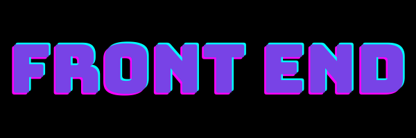

# Welcome to Softsquaregroup Tech Community Front End ✨

## 🌟 What is This Community About?
We are a vibrant, inclusive, and collaborative community of Front End developers. Whether you're just starting out or you're a seasoned expert, this is the place for sharing ideas, solving challenges, and advancing your skills in modern Front End technologies.

---

## 💡 Key Features of Our Community

### 1. **Engage with Front End Experts**
- Connect with professionals from diverse backgrounds.
- Participate in discussions about the latest trends in Front End development.

### 2. **Activities and Knowledge Sharing**
- Weekly knowledge-sharing sessions.
- Hands-on workshops and coding challenges.
- Monthly webinars hosted by industry experts.

### 3. **Evaluation and Certification**
- Showcase your skills by participating in community evaluations.
- Earn certificates recognized across the industry.

### 4. **Open Collaboration**
- Contribute to open-source projects.
- Get involved in peer-to-peer code reviews.

---

## 🚀 How to Get Started

1. **Join the Community**  
   [Sign Up Here](#) to become a part of our GitHub organization.

2. **Set Up Your Profile**  
   Share your skills, projects, and goals with the community.

3. **Start Collaborating**  
   - Explore active projects in the [Repositories](https://github.com/orgs/your-organization/repositories).
   - Join discussions in our [Discussions Forum](https://github.com/orgs/your-organization/discussions).

4. **Participate in Activities**  
   - Keep an eye on the [Activity Board](https://github.com/orgs/your-organization/projects) for upcoming events.
   - Submit your work for evaluation to earn certificates.

---

## 🌐 Stay Connected
- **Microsoft Team:** [Join Here](#)
- **Discord:** [Join Here](#)
- **Dev:** [Follow Us](#)

---

## 📢 Get Involved!

We welcome contributions from everyone! If you have ideas, projects, or skills to share, don't hesitate to get involved. Check out our [Contributing Guidelines](CONTRIBUTING.md) and start today!

---

## 🏆 Recognition and Rewards
- Earn badges for your contributions.
- Be featured as a "Contributor of the Month" on our social platforms.

---

> **"Building a stronger Front End community, one developer at a time!"**
